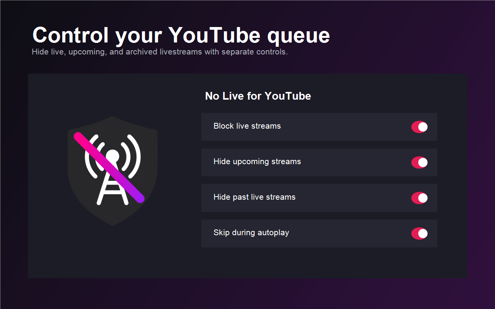

# No Live for YouTube

No Live for YouTube is a small browser extension that hides livestream content
from YouTube and keeps it out of autoplay.

> [!WARNING]
> **This extension is still being tested and may not always work.** YouTube
> changes its page structure frequently, which can temporarily break detection.
> Please report missed streams or incorrect filtering in GitHub Issues.



## What it blocks

- livestreams that are currently broadcasting;
- scheduled and upcoming streams;
- automatically archived recordings of completed livestreams;
- blocked stream videos selected by YouTube autoplay.

Each category can be controlled from the extension popup. The extension still
allows a livestream that you deliberately open yourself.

## Browser support

| Browser | Status |
| --- | --- |
| Chrome and Chromium | Testing |
| Opera / Opera GX | Testing |
| Firefox 140+ desktop / 142+ Android | Experimental |

Firefox support uses the same Manifest V3 source but should be considered less
tested than Chromium support.

## Install a release

Download the package for your browser from the
[latest GitHub release](https://github.com/dziorke/no-live-for-youtube/releases/latest).

- Chromium/Opera: extract the Chromium ZIP, enable developer mode on the
  extensions page, and choose **Load unpacked**.
- Firefox development testing: open `about:debugging`, select **This Firefox**,
  choose **Load Temporary Add-on**, and select the downloaded XPI or `manifest.json`.

Store installations will be documented here after the listings are approved.

## Install from source

1. Clone or download this repository.
2. Open `chrome://extensions` or `opera://extensions`.
3. Enable **Developer mode**.
4. Click **Load unpacked** and select the repository folder.
5. Reload any YouTube tabs that were already open.

## Privacy

No Live for YouTube has no analytics, ads, accounts, tracking, or remote service.
Settings are stored locally in the browser. Page information is inspected only
to classify YouTube videos and is never sent anywhere by the extension. See the
full [privacy policy](PRIVACY.md).

## Building packages

On Windows PowerShell:

```powershell
powershell -NoProfile -ExecutionPolicy Bypass -File .\scripts\build.ps1
```

The command validates the manifest and creates Chromium ZIP and Firefox XPI
packages plus SHA-256 checksums in `dist/`.

To regenerate icons and store artwork from the checked-in source image:

```powershell
powershell -NoProfile -ExecutionPolicy Bypass -File .\scripts\process-assets.ps1
```

## Contributing

Bug reports are especially useful while the extension is in testing. Include
your browser version, YouTube language, the page where the stream appeared, and
whether the problem involved filtering or autoplay. See [CONTRIBUTING.md](CONTRIBUTING.md).

## Disclaimer

This independent project is not affiliated with, endorsed by, or sponsored by
YouTube or Google. YouTube is a trademark of Google LLC.

## License

Released under the [MIT License](LICENSE).
